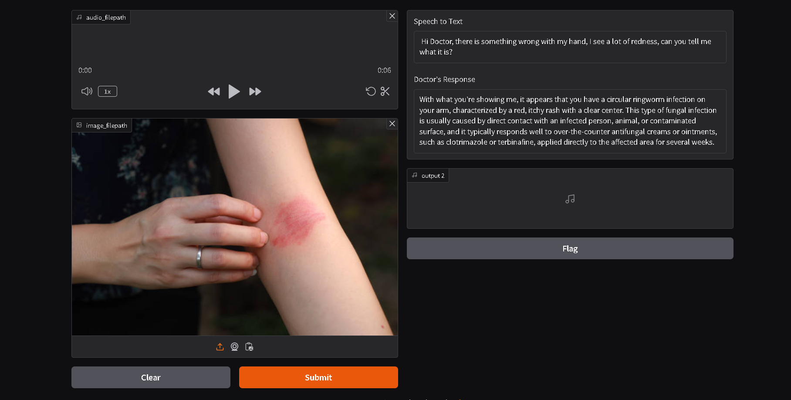

# AI Doctor with Vision and Voice



## Overview
AI Doctor with Vision and Voice is an AI-powered medical assistant designed to analyze medical images, process patient speech, and generate professional medical responses. This project integrates speech recognition, text-to-speech synthesis, and multimodal AI analysis to provide insightful medical feedback.

## Features
- **Speech Recognition:** Converts patient speech into text using Google's Whisper model.
- **Image Analysis:** Processes medical images to detect potential conditions and provide insights.
- **AI-Powered Diagnosis:** Generates professional medical responses based on speech and image inputs.
- **Text-to-Speech:** Converts the AI doctor's response into a realistic voice output.
- **User-Friendly UI:** Built with Gradio for an interactive experience.

## Project Structure
```
AI_Doctor_Project/
│── app.py                     # Main application file
│── Workflow/
│   ├── brain_of_doctor.py      # Image analysis and AI model integration
│   ├── voice_of_doctor.py      # Text-to-speech conversion
│   ├── voice_of_patient.py     # Audio recording and speech-to-text processing
│── requirements.txt            # Required dependencies
│── .env                        # API keys and environment variables
```

## Installation
1. **Clone the Repository:**
   ```sh
   git clone https://github.com/PriyanshuDey23/AI-Powered-Doctor-with-Vision-and-Voice.git
   cd AI_Doctor_Project
   ```

2. **Set Up Virtual Environment (Optional but Recommended):**
   ```sh
   python -m venv venv
   source venv/bin/activate  # On Windows use 'venv\Scripts\activate'
   ```

3. **Install Dependencies:**
   ```sh
   pip install -r requirements.txt
   ```

4. **Set Up Environment Variables:**
   Create a `.env` file and add your API key:
   ```
   GROQ_API_KEY=your_groq_api_key
   ```

## Usage
1. **Run the Application:**
   ```sh
   python app.py
   ```
2. **Interact with the AI Doctor:**
   - Upload a medical image (optional).
   - Speak into the microphone to describe symptoms.
   - Receive AI-generated medical insights.
   - Listen to the doctor's response in an audio format.

3. **Access the Web Interface:**
   - The application runs locally at: `http://127.0.0.1:7860/`

## Technology Stack
- **Python** (Primary Language)
- **Gradio** (Web Interface)
- **Groq API** (Multimodal AI Model for Image Analysis & Speech-to-Text Processing)
- **Google Text-to-Speech (gTTS)** (Text-to-Speech Conversion)
- **SpeechRecognition** (Voice Processing)

## Future Enhancements
- Expand support for additional medical image formats.
- Improve AI diagnosis accuracy with more advanced models.
- Add multi-language support for diverse patient interactions.
- Deploy the application as a cloud-based service.

## License
This project is licensed under the MIT License. See `LICENSE` for more details.

---
🚀 **AI Doctor with Vision and Voice - Bringing AI-Powered Medical Insights to Life!**

